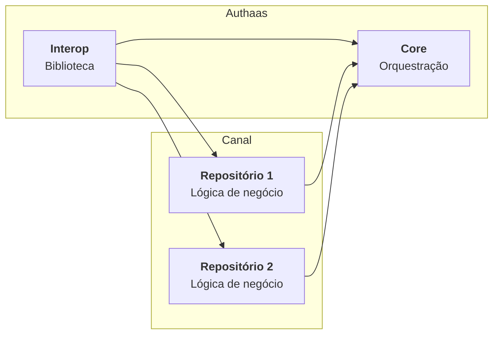

## AMC

A plataforma AMC (sigla para Access Management for Customers) é um conjunto de repositórios de código e ferramentas bem estabelecidas no mercado com a finalidade de prover e gerenciar diversos fluxos de autenticação. Uma das grandes dificuldades para alcançar esse objetivo é ser capaz de manter uniformidade e permitir a integração de novos fluxos de maneira simples, em outras palavras, ser uma solução extensível. Dito isso, o AMC aborda essa situação desacoplando a camada de orquestração das diferentes implementações de fluxos de autenticação, bem como fornece as ferramentas necessárias para a integração entre ambos.

Para entender como o AMC faz o que se propõe, é preciso entender sua estrutura. Falando sobre repositórios de código, primeiramente, temos o repositório **core** onde a lógica de orquestração da autenticação está. Nele, estão definidas as estruturas de cada uma das fases do fluxo de autenticação, onde cada fase é implementada pelo que aqui chamamos de *adapter*. Em seguida, temos os repositórios de canal que implementam a lógica de negócio de cada fluxo de autenticação. Por exemplo, um repositório pode implementar a lógica de um fluxo de autenticação para pessoas físicas, enquanto outro para pessoas jurídicas. Em ambos os casos, os fluxos são conduzidos pela lógica definida no repositório core. Por fim, temos o repositório **interop** que atua como uma biblioteca compartilhada entre core e repositórios de canal. Esse repositório contém integrações com diversos sistemas externos como EQ3, UD, etc. e, mais importante, contém as interfaces necessárias que os serviços nos repositórios de canal devem implementar a fim de serem orquestrados pelo core.

O diagrama abaixo ilustra a dependência de cada um dos repositórios, assim como seus reponsáveis.

### Fases da Autenticação

Anteriormente, foi dito que as fases da autenticação são implementadas por adapters. Aqui, veremos quais adapters compõe o fluxo e também suas especificações.

* Bootstrap Adapter:
* Configuration Adapter:
* Pre Identity Adapter:
* Identity Adapter:
* Password Adapter:
* RBA Adapter:

Os canais podem desenvolver serviços para cada uma das fases mencionadas acima. Para isso, é necessário implementar a respectiva interface disponível no repositório interop.

### Exempo WEB

### Exempo Native

TODO: Guia de Uso