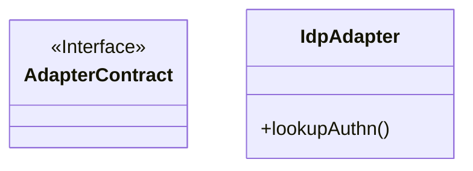
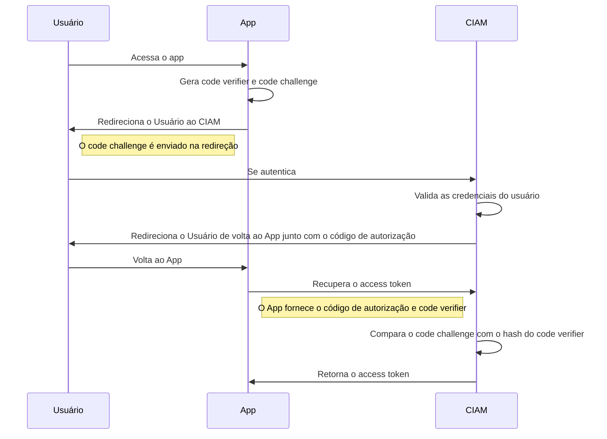

# CIAM Architecture

## PCKE (Proof Key for Code Exchange)

PCKE é uma extensão do framework OAuth 2.0 que permite ao servidor de autorização garantir que o cliente que inicia um fluxo de autorização é o mesmo que o termina, assim melhorando a segurança dos usuários, já que evita ataques como o uso de um código de autorização que foi interceptado após autenticação. Essa extensão foi originalmente projetada para substituir o fluxo de grant type "implict" usado por clientes que não são capazes de armazenar senha de maneira segura. Um exemplo seria um SPA (abreviação para "single page application") ou uma aplicação mobile. Entretanto, devido a suas vantagens, a recomendação é que também seja utilizado em conjunto com o grant type "authorization_code" para clientes confidenciais.

A extensão PCKE funciona basicamente como o grant type "authorization_code", com algumas modificações. A primeira é, antes de redirecionar o usuário ao endpoint de autorização, a aplicação cliente é responsável por gerar duas strings: `code verifier` e `code challenge`. O code verifier é uma sequência aleatória de caracteres com tamanho entre 43 e 128, já o code challenge é o hash do code verifier, mais precisamente o resultado da expressão `base64urlencode(sha256(code_verifier))`. A segunda mudança ocorre ao de requisitar o access token. Para clientes públicos, ao invés de fornecer uma senha, a aplicação cliente fornece o code verifier como parâmetro da requisição. Assim, o servidor de autorização pode calcular o hash do code verifier e compará-lo ao code challenge fornecido anteriormente. Se esses valores corespondem, o servidor gera o access token ao cliente.

O diagrama abaixo ilustra como o fluxo ocorre.

