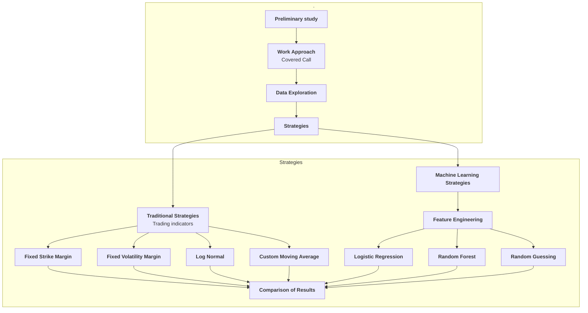

```mermaid
flowchart TD

    subgraph .
    exploration["`**Preliminary study**`"]
    
    approach["`**Work Approach**
    Covered Call`"]
    data_exploration["`**Data Exploration**`"]
    strategies["`**Strategies**`"]

    exploration --> approach
    approach --> data_exploration
    data_exploration --> strategies
    end


    subgraph Strategies

    traditional_strategies["`**Traditional Strategies**
    Trading indicators`"]
    fix_strike_margin["`**Fixed Strike Margin**`"]
    fix_volatility_margin["`**Fixed Volatility Margin**`"]
    log_normal["`**Log Normal**`"]
    custom_ma["`**Custom Moving Average**`"]

    ml_strategies["`**Machine Learning Strategies**`"]
    feature_engineering["`**Feature Engineering**`"]
    logistic_regression["`**Logistic Regression**`"]
    random_forest["`**Random Forest**`"]
    random["`**Random Guessing**`"]

    comparison["`**Comparison of Results**`"]


    strategies --> traditional_strategies
    strategies --> ml_strategies
    ml_strategies --> feature_engineering

    traditional_strategies --> fix_strike_margin
    traditional_strategies --> fix_volatility_margin
    traditional_strategies --> log_normal
    traditional_strategies --> custom_ma

    
    feature_engineering --> logistic_regression
    feature_engineering --> random_forest
    feature_engineering --> random

    fix_strike_margin --> comparison
    fix_volatility_margin --> comparison
    log_normal --> comparison
    custom_ma --> comparison
    logistic_regression --> comparison
    random_forest --> comparison
    random --> comparison

    end
```